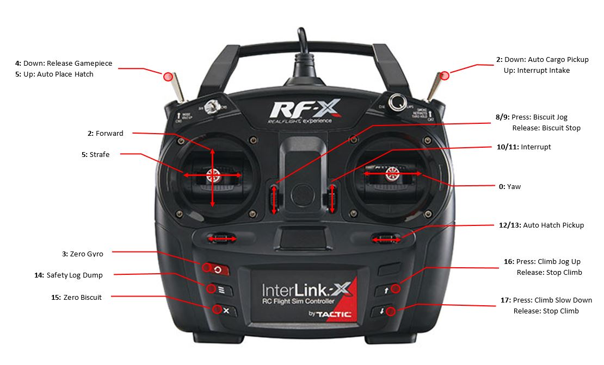
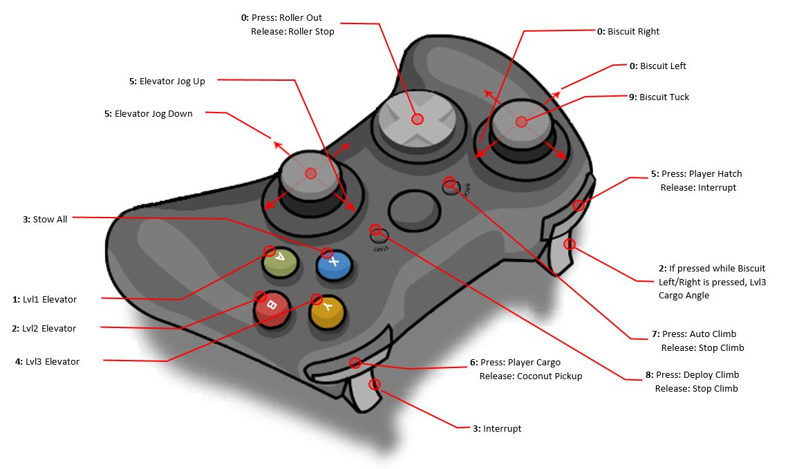

# 2019 FIRST DEEP SPACE

## Controls

## Talons

Subsystem    | Talon       | ID | PDP
------------ | ----------- | -- | ---
Drive        | azimuth     | 0  | 11
Drive        | azimuth     | 1  | 9
Drive        | azimuth     | 2  | 10
Drive        | azimuth     | 3  | 8
Drive        | drive       | 10 | 14
Drive        | drive       | 11 | 13
Drive        | drive       | 12 | 15
Drive        | drive       | 13 | 12
Intake       | shoulder    | 20 | 4
Intake       | rollers     | 21 | 5
Elevator     | elevator    | 30 | 0
Biscuit      | rotate      | 40 | 7
Climb        | leftSlave   | 50 | 2
Climb        | rightMaster | 51 | 3
Vacuum       | vacuum      | 60 | 1

* Trident compression sensor attached to Biscuit Talon analog input
* Vacuum Sensor attached to Vacuum Talon analog input

## Servos

Subsystem   | Servo              | PWM
----------- | ------------------ | ---
Climb       | leftKickstand      | 2
Climb       | rightKickstand     | 3
Climb       | ratchet            | 4

## DIO

Subsystem   | I/O            | DIO
----------- | ---------------| ---
AutonSwitch |  0             | 0
AutonSwitch |  1             | 1
AutonSwitch |  2             | 2
AutonSwitch |  3             | 3
Intake      |  slowBeamBreak | 4
Vision      | lights         | 5
Vision      | lights         | 6
Robot       | eventFlag(BNC) | 7
Intake      | beamBreak      | 8
Vision      | cam1Tune       | 9

## Analog Inputs

Subsystem | I/O        | Analog
--------- |----------- |-------
Vacuum    | tempSensor | 0
Vacuum    | climbPlate | 1 

## Roborio

Subsystem | I/O      | Button
--------- | -------- | -----------
Vision    | cam0Tune | User Button

## PCM

Subsystem | Valve         | Solenoid
--------- | ------------- | --------
Vacuum    | trident(hatch)| 0
Vacuum    | climb         | 2
Vacuum    | trident(cargo)| 3
